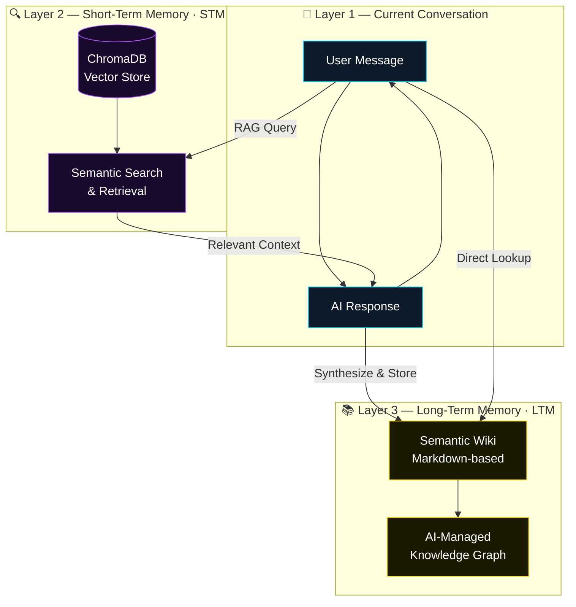

<p align="center">
  
</p>

<h1 align="center">🧠 Ulisse Brain</h1>

<p align="center">
  <strong>A persistent memory infrastructure for LLMs.<br/>Installable. Customizable. Private.</strong>
</p>

<p align="center">
  <a href="#-installation"></a>
  <a href="LICENSE"></a>
  <a href="#-project-status"></a>
  <a href="https://github.com/FridaAlma/UlisseAI"></a>
</p>

<br/>

<p align="center">
  <em>Turn any LLM into an entity with continuous memory.</em><br/>
  <em>Not just a chatbot — a full cognitive architecture.</em>
</p>

---

## ✨ What is Ulisse?

Ulisse is a system that allows a language model to **remember what you told it**, even across different sessions. It's an architecture that turns a generic LLM into an entity with continuous memory, capable of updating its own knowledge as it talks to you.

<table>
<tr>
<td width="33%" align="center">

### 💻 Local Models
Ollama, LM Studio, or any<br/>OpenAI-compatible server

</td>
<td width="33%" align="center">

### 🔑 Remote APIs
OpenAI, DeepSeek, Claude,<br/>or any provider with an API key

</td>
<td width="33%" align="center">

### 🔮 Ulisse Memo v1
Fine-tuned cloud model<br/><sub>⚠️ Temporarily suspended</sub>

</td>
</tr>
</table>

---

## 🏗️ Architecture — Three Memory Layers

Ulisse is built on a **three-layer cognitive architecture**. The user doesn't need to configure any of this — it works out of the box.



| Layer | Name | Technology | Purpose |
|:---:|---|---|---|
| 1️⃣ | **Current Conversation** | In-context window | Immediate chat context |
| 2️⃣ | **STM (RAG)** | ChromaDB vectors | Context-aware retrieval from past sessions & docs |
| 3️⃣ | **LTM (Wiki)** | Markdown semantic wiki | AI-managed persistent knowledge, projects & facts |

---

## ⚡ Capabilities & Toolkits

Ulisse is not just a chatbot — it is an **agentic system** equipped with a specialized sub-agent and native tools to interact with the real world.

<table>
<tr>
<td width="50%" valign="top">

### 🛠️ Native Tools
<sub>Directly built into the core for maximum reliability</sub>

| Tool | Description |
|---|---|
| 📂 **Workspace Reader** | List files and folders in your project |
| 📄 **File Reader** | Open and read any file within the workspace |
| 📝 **Wiki Manager** | Read, write, and organize semantic long-term memory |

</td>
<td width="50%" valign="top">

### 🤖 Agno Agent <sub>(Sub-Agent)</sub>
<sub>A powerful autonomous engine for complex tasks</sub>

| Tool | Description |
|---|---|
| 🌐 **Web Search** | Browse the internet for real-time information |
| 🐍 **Python Runner** | Execute Python scripts for complex logic |
| 💻 **Shell Access** | Execute terminal commands in the workspace |
| 📊 **CSV Analysis** | Query large datasets via DuckDB SQL |
| 🕸️ **Browser** | Advanced web scraping *(optional)* |

</td>
</tr>
</table>

---

## 🚀 Installation

### Prerequisites

- **Python 3.11+**
- An LLM API key **OR** Ollama/LM Studio running locally **OR** Ulisse Memo v1 *(currently offline)*

> [!NOTE]
> **First-time setup:** On the first launch, the system will automatically download **`all-MiniLM-L6-v2`** (~80 MB) for RAG embeddings and ChromaDB dependencies. These are cached locally in `./hf_cache` and `./vectordb`. Subsequent startups will be faster.

### Quick Start

```bash
# 1. Clone the repository
git clone https://github.com/FridaAlma/UlisseAI.git
cd UlisseAI

# 2. Install dependencies
pip install -r requirements.txt

# 3. Configure environment
cp .env.example .env
```

Edit `.env` with your settings:

```env
DEEPSEEK_API_KEY=your_key_here
DEEPSEEK_BASE_URL=https://api.deepseek.com
CORPUS_PATH=./corpus
VAULT_PATH=./vault
VECTORDB_PATH=./vectordb
```

```bash
# 4. Launch
python webapp/backend/app.py
```

Then open **http://localhost:5000** 🎉

---

## 🌐 Choosing the AI Model

In the chat interface, next to the **Send** button you'll find a 🌐 **network button** that opens a provider selector:

| Option | Icon | Description |
|:---|:---:|:---|
| **LLM Locale** | 💻 | Connects to a local model (Ollama, LM Studio, etc.). Uses `DEEPSEEK_BASE_URL` / `DEEPSEEK_API_KEY` from `.env` |
| **API Key** | 🔑 | Enter any provider's Base URL, API Key, and model name directly from the UI. Saved in `localStorage` |
| **Ulisse Memo v1** | 🔮 | ~~Cloud fine-tuned model~~ — *Currently offline for maintenance* |

> Your choice is **persisted in the browser** across reloads.

<details>
<summary><strong>⚙️ Advanced: Changing the Model Manually</strong></summary>

<br/>

#### Option A — Local / Default model

Edit `.env`:

```env
DEEPSEEK_API_KEY=your_key_here
DEEPSEEK_BASE_URL=https://api.deepseek.com   # or http://localhost:11434/v1 for Ollama
```

Then in `webapp/backend/app.py`, find and change:

```python
chat_model = "deepseek-chat"  # → "gpt-4o", "llama3", "qwen2.5:7b", etc.
```

#### Option B — Ulisse Memo v1 endpoint

> [!NOTE]
> **Maintenance Notice:** The Ulisse Memo v1 endpoint is currently suspended. Please use a Local Model or a custom API Key in the meantime.

#### Option C — Fully custom provider in code

In `webapp/backend/app.py`, locate the provider routing block (~line 408):

```python
# === Provider routing ===
provider = data.get("provider", "local")
```

You can add new branches here to support additional providers at the server level.

</details>

---

## 🧬 System Prompt

Ulisse operates using a specialized system prompt located in `corpus/system_prompt.md`.

> [!TIP]
> **Customizing the System Prompt:** You can personalize Ulisse's behavior, but proceed with care:
> - ✅ **Identity and Role** — Freely modify to redefine who Ulisse is
> - ⚠️ **Personality and Tone** — Adjustable, but heavy changes may increase hallucinations. *Adaptability* and *Irony* are safe to customize
> - 🚫 **Technical Instructions** — **Do not modify.** Memory architecture (STM/LTM) and Wiki management depend on specific instructions

---

## 🛠️ Tech Stack

<p align="center">

| Component | Technology |
|:---|:---|
| **Runtime** | Python 3.11+ |
| **Vector DB** | ChromaDB |
| **LLM Provider** | DeepSeek / OpenAI-compatible |
| **Long-Term Memory** | Semantic Wiki (Markdown) |
| **Knowledge Graph** | Obsidian-compatible |
| **Backend** | Flask |
| **Frontend** | Vanilla JS (single-page application) |

</p>

---

## 📊 Project Status

<table>
<tr>
<td>

```
██████████████████░░░░░  ~75%
```

</td>
<td>

**Active Development** — Functional and in testing phase.<br/>
Contributions, bug reports, and ideas are welcome!

</td>
</tr>
</table>

---

## 📜 License

This project is licensed under the **[Apache License 2.0](LICENSE)**.

---

<p align="center">
  <sub>Built with 🧠 by <a href="https://github.com/FridaAlma">FridaAlma</a></sub><br/>
  <sub>
    <a href="https://github.com/FridaAlma/UlisseAI/issues">Report Bug</a> · 
    <a href="https://github.com/FridaAlma/UlisseAI/issues">Request Feature</a>
  </sub>
</p>
